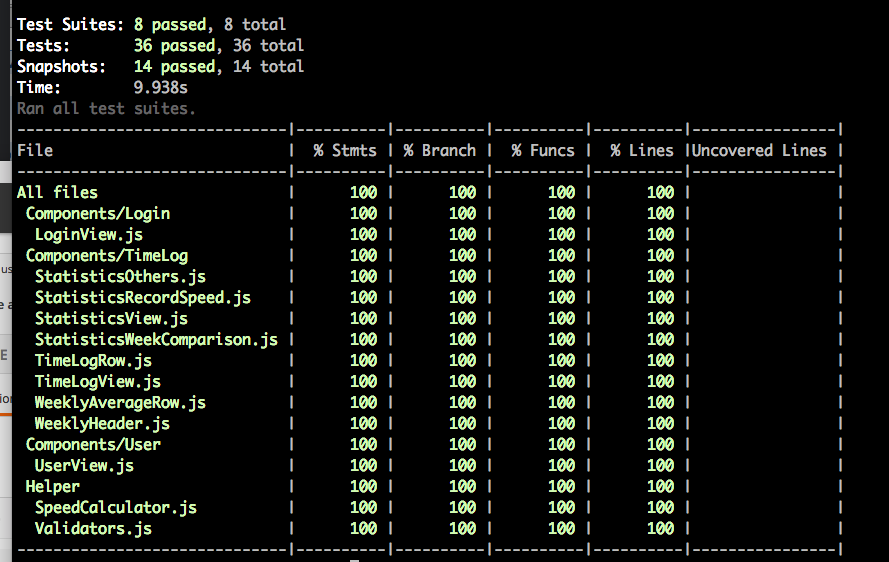

# Jogging Time Logger

###Objective
#### Write an application that tracks jogging times of users

* User must be able to create an account and log in. (If a mobile application, this means that more users can use the app from the same phone).
* When logged in, a user can see, edit and delete his times he entered.
* Implement at least three roles with different permission levels: a regular user would only be able to CRUD on their owned records, a user manager would be able to CRUD users, and an admin would be able to CRUD all records and users.
* Each time entry when entered has a date, distance, and time.
* When displayed, each time entry has average speed.
* Filter by dates from-to.
* Report on average speed & distance per week.
* REST API. Make it possible to perform all user actions via the API, including authentication (If a mobile application and you don’t know how to create your own backend you can use Firebase.com or similar services to create the API).
* In any case, you should be able to explain how a REST API works and demonstrate that by creating functional tests that use the REST Layer directly. Please be prepared to use REST clients like Postman, cURL, etc. for this purpose.
* All actions need to be done client side using AJAX, refreshing the page is not acceptable. (If a mobile app, disregard this).
* You will not be marked on graphic design, however, do try to keep it as tidy as possible.
* Users should be allowed to add a location to entries. If provided show this location on a map.
* Calculate some statistics: the fastest/slowest jog in the week/month/year, a day with the greatest distance ran, comparison of the previous and last week, the percentage of cumulative distance vs. moon distance (assume 384.000 km or 238.900 mi), the total time spent while jogging.
* Users have to be able to upload and change their profile picture.
* Write unit and e2e tests.


## Mobile app

Install `react-native`. To launch in iOS or Android,

```
cd jogging_time_tracker
react-native run-ios 
react-native run-android
```

## Server

To start the server,

```
cd jogging_time_tracker_featherjs
npm start
```

## Test

### Mobile Unit testing

To run unit test,

```
cd jogging_time_tracker
npm test
npm run cover
```


### Mobile E2E testing

To run the e2e test, restart server. 

```
cd jogging_time_tracker
npm run detox-build
npm run detox-text
```




